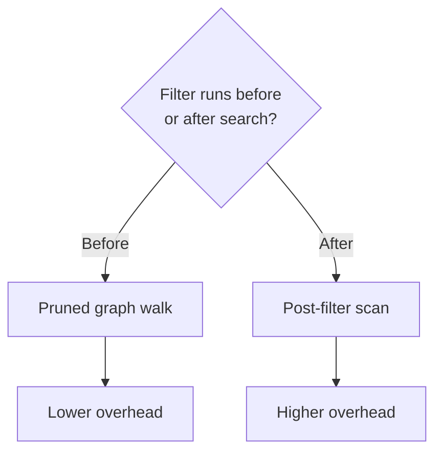

# Diagrams

<!-- register-exempt: BOLD-FIRST-BULLET SWE-JARGON UNDEFINED-ACRONYM -->
<!-- A diagram reference: SVG, CSS, TD, LR, and the Mermaid keywords are
     standard terms. -->

Mermaid for structure, hand-written SVG for anything Mermaid cannot express.

## Mermaid

Write a fenced `mermaid` block in markdown, or the markup by hand:

```html
<div class="figure breakout">
  <div class="figure__body">
    <pre class="mermaid">
flowchart TD
    A["Exam set"] --> B["Timeslot assignment"]
    </pre>
  </div>
</div>
```

The module in `template.html` initialises Mermaid with `startOnLoad: false`,
builds its theme from the page tokens, and re-renders on `themechange`. It
keeps the original text in `data-src`, because Mermaid replaces the element
content with an SVG on the first pass.

Every supported diagram type works: `flowchart`, `sequenceDiagram`,
`stateDiagram-v2`, `classDiagram`, `erDiagram`, `gantt`, `pie`, `journey`,
`mindmap`, `timeline`.

### A labelled decision branch

The common shape in a report. The label on each edge says what the branch
means, so the reader needs no legend.

````markdown

````

An edge label is painted with `--surface`, so it matches the figure card it
sits on. Keep a label to one or two words.

### The theme mapping

| Mermaid variable | Token |
|---|---|
| `background` | `--bg` |
| `primaryColor`, `mainBkg`, `actorBkg`, `edgeLabelBackground` | `--surface` |
| `secondaryColor` | `--surface-2` |
| `tertiaryColor`, `clusterBkg`, `noteBkgColor` | `--bg-tint` |
| `primaryTextColor`, `textColor`, `titleColor` | `--text` |
| `lineColor`, `signalColor` | `--text-muted` |
| `primaryBorderColor`, `nodeBorder` | `--border` |
| `pie1` to `pie6`, `cScale0` to `cScale2` | `--data-1` to `--data-6` |

Change a token and every diagram follows. Do not put a colour in the diagram
source, because it survives the theme switch and then clashes.

### Sizing and diagram direction

Every diagram type sets `useMaxWidth: false`, so Mermaid renders at its
natural size. The figure wrapper uses `width: fit-content`, so the card hugs
the diagram, and `max-width: 100%` scales an oversized one down.

**A wide diagram scales down, and its labels shrink with it.** A left-to-right
flowchart with 7 labelled nodes is about 1800px wide. Inside an 880px figure
it renders at half scale, and 16px labels become 8px.

Three rules follow.

1. **Use `flowchart TD` for a report diagram.** Vertical growth costs height,
   which the page has. Horizontal growth costs scale, which it does not.
2. **Keep a node label under about 25 characters.** Break a longer one with
   `<br/>`.
3. **Split a diagram past about 10 nodes.** Two diagrams, each with its own
   caption, beat one unreadable diagram.

`flowchart LR` still suits a short chain of three or four nodes.

### Diagram selection

Draw a diagram when it shows a mechanism a paragraph cannot: a branch, a
loop, a handover between phases, a dependency. A diagram that
restates a list in boxes is worse than the list.

## Hand-written SVG

Reach for SVG when the drawing states something Mermaid has no syntax for: an
annotated architecture, a spatial relationship, a labelled measurement.

```html
<div class="figure breakout">
  <div class="figure__body">
    <svg viewBox="0 0 720 240" role="img" aria-label="Encoder pipeline">
      <rect x="20" y="90" width="150" height="60" rx="10"
            fill="rgb(var(--surface-2))" stroke="rgb(var(--border))"/>
      <text x="95" y="125" text-anchor="middle"
            fill="rgb(var(--text))" font-size="14">Vision encoder</text>
      <path class="flow-line" d="M 170 120 H 260"
            stroke="rgb(var(--accent))" stroke-width="2" fill="none"/>
    </svg>
  </div>
  <p class="figure__caption"><strong>Figure 4:</strong> The pipeline.</p>
</div>
```

Four rules.

1. **Use `viewBox`, never a fixed width and height.** The figure scales then.
2. **Paint with tokens.** `fill="rgb(var(--surface-2))"` follows the theme.
   A hex value does not.
3. **Set `role="img"` and an `aria-label`.** A decorative SVG takes
   `aria-hidden="true"` instead.
4. **Text at 14px or larger.** Anything smaller disappears once the figure
   scales down.

### The animated connector

`.flow-line` draws a dashed stroke that travels along the path, which reads as
a direction of flow. The recipe comes from the complete FastVLM page, where
the class is defined and never used.

```html
<path class="flow-line" d="…" stroke="rgb(var(--accent))" stroke-width="2" fill="none"/>
```

It stops under `prefers-reduced-motion`. Use it on one path in a diagram, not
on every path.

### Pulse highlight

`.pulse-highlight` breathes a node to draw the eye to it, from the Super
Weight page. One element per figure, at most.

## Choosing between the two

| The need | The form |
|---|---|
| Boxes, arrows, branches, loops | Mermaid flowchart |
| An exchange between actors over time | Mermaid sequence |
| States and transitions | Mermaid state |
| Schedule bars against dates | Mermaid gantt |
| An annotated architecture with custom shapes | hand-written SVG |
| A spatial or physical relationship | hand-written SVG |
| Numbers | not a diagram, see DATA-VISUALIZATION.md |
