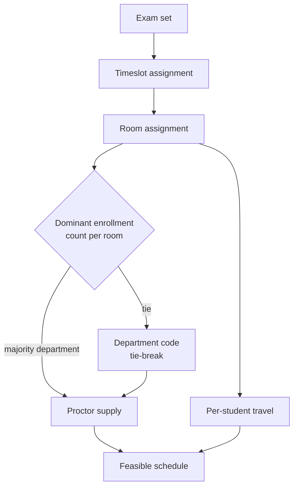
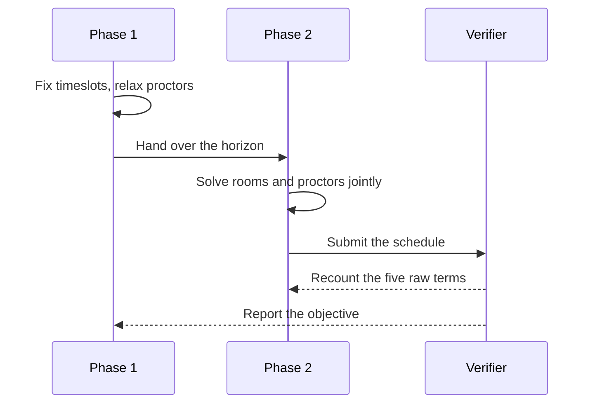

This page proves the converter. It uses every markdown construct the build
script supports, so a rendering problem shows up here before it reaches a real
report. Read it as a specimen.

The study measures one question. When each room draws its proctor from the
department with the most students in that room, how much harder does the
schedule become? The short answer: solve time rises by a factor of four, and
the travel objective degrades by 11 percent.[^rule]

## Summary

The report rests on three findings.

1. The attribution rule removes the separability that makes room assignment
   cheap. Rooms can no longer be filled independently of the proctor pool.
2. Per-student travel cost responds sharply to the exam horizon. A schedule
   one day shorter costs students about 8 percent more travel.
3. A two-phase search recovers most of the loss. It reaches 97 percent of the
   single-phase objective in a quarter of the time.

> [!NOTE]
> Every number on this page is synthetic. The demo report only exercises the
> page template, and no result here describes a real instance.

### The rule

In each room, the department with the most students supplies the proctor.
Ties break on the department code. The rule reads simply, and it couples three
decision families that a standard formulation keeps apart.

> The rule sounds administrative. In the model it is structural: it ties the
> room variables to the proctor variables through a count that only exists
> once the timeslot is fixed.
> <cite>Section 3.2, problem description</cite>

## Method

The formulation extends a standard examination timetabling model with one
attribution constraint family and one soft travel term.

### Instance set

Three instances come from one Vietnamese open-enrollment program.

| Instance | Students | Exams | Rooms | Departments | Horizon |
|---|---:|---:|---:|---:|---:|
| 2025_09_HCM | 4,180 | 96 | 42 | 7 | 9 days |
| 2025_12_HCM | 5,640 | 118 | 42 | 7 | 11 days |
| 2026_03_HAN | 3,020 | 74 | 28 | 5 | 8 days |

### Solver configuration

Every run uses the same budget. The seed is fixed, so a rerun reproduces the
number exactly.

```python
from ortools.sat.python import cp_model

def solve(instance, seconds=180):
    model = build_model(instance)
    solver = cp_model.CpSolver()
    solver.parameters.max_time_in_seconds = seconds
    solver.parameters.num_workers = 8
    solver.parameters.random_seed = 20260810
    status = solver.Solve(model)
    return solver, status
```

Call it from the command line with the instance name and the budget:

```bash
python -m src.pipeline.run --instance 2025_12_HCM --seconds 180 --verify
```

## Results

Solve time grows with the attribution rule in place, and the gap widens with
instance size.

```chart
{
  "type": "groupedBar",
  "title": "Solve time to a 2 percent gap",
  "subtitle": "Lower is better. 180 second budget, 8 workers.",
  "categories": ["2026_03_HAN", "2025_09_HCM", "2025_12_HCM"],
  "unit": "s",
  "series": [
    {"name": "Baseline", "values": [11, 24, 38]},
    {"name": "With attribution rule", "values": [38, 96, 172]}
  ],
  "caption": "The attribution rule multiplies solve time by roughly four, and the factor grows with the number of departments."
}
```

The travel objective tells the opposite story about horizon length. A shorter
exam period looks efficient on paper and costs students more movement.

```chart
{
  "type": "line",
  "title": "Per-student travel against horizon length",
  "subtitle": "Mean kilometres per student, 2025_12_HCM.",
  "categories": ["7 d", "8 d", "9 d", "10 d", "11 d", "12 d"],
  "unit": " km",
  "smooth": true,
  "series": [
    {"name": "Single phase", "values": [46.2, 41.8, 38.4, 35.9, 34.6, 34.1]},
    {"name": "Two phase", "values": [48.0, 43.1, 39.5, 36.8, 35.4, 34.9]}
  ],
  "caption": "Travel falls steeply until day 10 and then flattens. The two-phase search stays within 3 percent of the single-phase curve."
}
```

Room utilisation stays close to the baseline, which shows the rule costs time
rather than capacity.

```chart
{
  "type": "bar",
  "title": "Room utilisation by campus",
  "horizontal": true,
  "unit": "%",
  "categories": ["Campus A", "Campus B", "Campus C", "Campus D"],
  "series": [{"name": "Utilisation", "values": [92, 87, 78, 61]}],
  "caption": "Campus D stays under-used because only two departments hold exams there."
}
```

### Budget split by phase

The search spends most of its budget proving the bound, not finding the
incumbent.

```chart
{
  "type": "stackedBar",
  "title": "Budget split by search phase",
  "unit": "s",
  "categories": ["2026_03_HAN", "2025_09_HCM", "2025_12_HCM"],
  "series": [
    {"name": "First incumbent", "values": [4, 9, 14]},
    {"name": "Improvement", "values": [12, 31, 48]},
    {"name": "Proving the bound", "values": [22, 56, 110]}
  ],
  "caption": "Proving the bound takes about 60 percent of the budget in every instance."
}
```

## Structure of the coupling

The attribution rule sits between the room decision and the proctor decision,
which is why it cannot be separated out.



The two-phase search reorders that chain. It fixes timeslots first, then
solves rooms and proctors together against the fixed horizon.



## Verification

Each run recounts its five raw objective terms outside the solver. A mismatch
means the model and the evaluator disagree, and the run is discarded.

> [!WARNING]
> A silent recount mismatch has appeared twice, both times from suffix
> stripping in the room identifier. Check the identifier before trusting a
> travel number.

Two checks pass on every instance in the set.

- The recount matches the solver objective to the last integer.
- No student takes two exams in one session, and no room is double-booked.

---

*Source: `reference/demo-report.md` in the `ui-design` skill. Rebuild with
`python scripts/build.py reference/demo-report.md -o out/`.*

[^rule]: The rule and its tie-break come from the program's own proctoring
    policy. The formulation appears in section 3.2 of the problem description.
