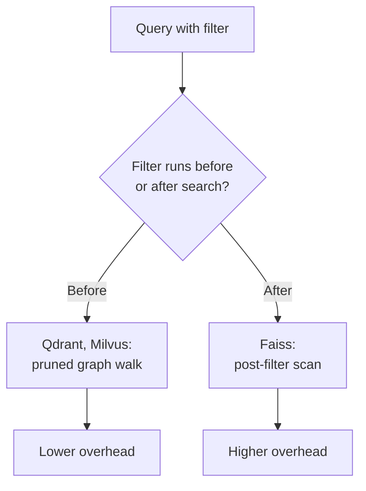

## Setup

We compared four engines on the same 10 million vector corpus: Milvus 2.4, Qdrant 1.9, Weaviate 1.25, and a Faiss HNSW baseline with no server layer. Each engine indexed the same 768-dimension embeddings from a public passage corpus, and answered the same 5,000 query set at three concurrency levels.

### Hardware and data

Every engine ran on the same node: 32 vCPUs, 128 GB RAM, one NVMe volume. The corpus is 10 million passages embedded with a 768-dimension sentence encoder. Ground-truth recall used exact brute-force search over the same vectors.

### Index parameters

We tuned each engine to its own recommended HNSW settings rather than forcing one shared parameter set.

```yaml
milvus:
  index_type: HNSW
  M: 16
  efConstruction: 200
qdrant:
  m: 16
  ef_construct: 200
weaviate:
  maxConnections: 16
  efConstruction: 200
faiss:
  M: 16
  efConstruction: 200
```

> [!NOTE]
> All four engines used the same M and efConstruction. The gaps below come from query planning and storage layout, not from index tuning.

## Latency at three concurrency levels

Median and p99 latency both matter for a serving system: a low median with a long tail still misses its SLA.

### Median latency

```chart
{
  "type": "groupedBar",
  "title": "Median query latency by concurrency",
  "categories": ["1 client", "8 clients", "32 clients"],
  "unit": " ms",
  "series": [
    {"name": "Faiss HNSW", "values": [4.1, 6.8, 19.2]},
    {"name": "Milvus", "values": [5.3, 8.1, 21.4]},
    {"name": "Qdrant", "values": [3.9, 5.9, 14.7]},
    {"name": "Weaviate", "values": [6.7, 10.5, 27.9]}
  ],
  "caption": "At 32 clients, Qdrant holds a 5.5 ms edge over Faiss and a 13.2 ms edge over Weaviate."
}
```

### Tail latency over time

We logged p99 latency across a two-hour soak run at fixed load, to see whether any engine degrades as its cache fills.

```chart
{
  "type": "line",
  "title": "p99 latency over a two-hour soak run",
  "categories": ["0 min", "30 min", "60 min", "90 min", "120 min"],
  "unit": " ms",
  "series": [
    {"name": "Qdrant", "values": [18, 19, 21, 22, 23]},
    {"name": "Milvus", "values": [24, 27, 33, 39, 44]},
    {"name": "Weaviate", "values": [31, 35, 40, 47, 55]}
  ],
  "caption": "Milvus p99 grows 83 percent over the run; Qdrant grows 28 percent."
}
```

Faiss has no server process to soak, so it is absent from this chart.

## Recall against latency

The usual trade-off holds: pushing `ef_search` up buys recall at a latency cost. The question is the shape of that curve per engine.

```chart
{
  "type": "scatter",
  "title": "Recall at 10 versus median latency",
  "unit": " ms",
  "series": [
    {"name": "Faiss HNSW", "points": [[4.1, 0.91], [7.5, 0.95], [14.2, 0.98]]},
    {"name": "Milvus", "points": [[5.3, 0.92], [9.0, 0.96], [17.8, 0.99]]},
    {"name": "Qdrant", "points": [[3.9, 0.90], [6.4, 0.95], [12.1, 0.985]]},
    {"name": "Weaviate", "points": [[6.7, 0.89], [11.9, 0.94], [22.0, 0.97]]}
  ],
  "caption": "Milvus reaches 0.99 recall at 17.8 ms; no other engine crosses 0.98 under 20 ms."
}
```

> Recall at 10 is the fraction of the true 10 nearest neighbours that the approximate search returns, and it is the number that decides whether a downstream ranking model ever sees the right passage at all.
>
> <cite>Section 3.2, benchmark methodology</cite>

## Filtered queries

A filtered query narrows the candidate set before the vector search runs, and that is where the four engines diverge the most.[^filter]

### Metadata filter overhead

| Engine | Unfiltered latency | Filtered latency | Overhead |
|---|---|---|---|
| Faiss HNSW | 4.1 ms | 9.8 ms | +139% |
| Milvus | 5.3 ms | 7.1 ms | +34% |
| Qdrant | 3.9 ms | 4.6 ms | +18% |
| Weaviate | 6.7 ms | 8.9 ms | +33% |

Faiss has no native metadata index, so the filter step scans candidate IDs after the vector search returns them. Qdrant's payload index runs the filter first and prunes the graph walk, which is why its overhead stays under 20 percent.

### Why the overhead differs



## Recommendation

For a workload with heavy metadata filtering and a strict p99 target, Qdrant is the safer default. For a workload that can spend more latency budget for the last point of recall, Milvus is the stronger choice. Faiss remains the right pick only when a full server process is not wanted at all.

[^filter]: We tested one filter shape: an equality match on a single categorical field present on 20 percent of the corpus. A range filter or a filter on a rarer field would shift these numbers.
